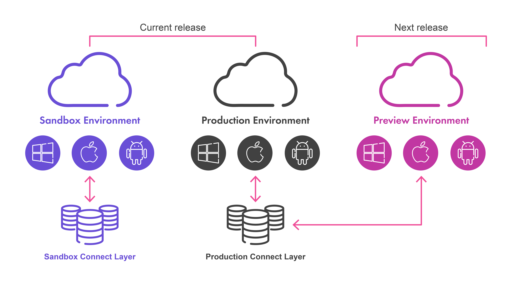

# Sandboxes / Payments-To-Go Sandbox

## PURPOSE
Finastra provides sandboxes with its core products, so that FinTechs and partners can connect to build, integrate, and test their innovative applications. A sandbox is a test environment with the same Finastra solutions that financial institutions are using across the world.

## OVERVIEW
Below sandboxes are test environments of Payments-To-Go, which are available to developers registered on [FusionFabric.cloud](https://developer.fusionfabric.cloud/) platform to perform API calls. The documentation on building Applications in the platform to access sandboxes is available here: [Get Started with FusionCreator.](https://developer.preprod.fusionfabric.cloud/documentation/get-started/index) These environments are fully capable products, and therefore it is possible to execute and test, on the sandbox, real use cases and end-to-end scenarios, for example initiating a payment via API and updating the payment status via other API calls.

## SANDBOXES
There are several sandbox instances, one in each region, with a specific Payments-To-Go configuration (payment rules).
The sandbox URLs are:

| Payments-To-Go Sandbox  | BaseURL |
| ------------- | ------------- |
| US & Americas  | (https://api.fusionfabric.cloud/login/v1/p2g-us-sandbox/) |

You can use the URLs according to the sandbox you need to access. For example:

*	https://api.fusionfabric.cloud/login/v1/p2g-us-sandbox/oidc/authorize
*	https://api.fusionfabric.cloud/login/v1/p2g-us-sandbox/oidc/token
*	https://api.fusionfabric.cloud/login/v1/p2g-us-sandbox/payment/payment-initiation/realtime-payments/v2/api/realtime-payments/tch-rtps/real_time/initiate

> Note:

- When you login on a sandbox, the token & subsequent API calls are only valid on the same sandbox.
- Passwords for B2B authentication on the password will be provided to you once your registration in [FusionFabric.cloud](https://developer.fusionfabric.cloud/) developer portal is complete.
- The sandbox is shared by multiple FinTechs, please do not enter any confidential information. Note also that sandbox data/content may be erased by Finastra for a daily or weekly clean-up.

## APIs & Solutions
Some examples of use cases that can be developed on the sandboxes are listed here: [Payments-APIs-Solutions.](https://developer.fusionfabric.cloud/explore/solutions?categories=Payments)
Here is the list of APIs that can be used on the sandboxes above. [Fusion Payments-To-Go APIs](https://developer.fusionfabric.cloud/explore/apis?coreProducts=Fusion%20Payments%20To%20Go)

## KEY FEATURES
### 1 – FULL PAYMENTS-TO-GO SOLUTION
The sandbox contains a full version of the Payments-To-Go solution, and your API calls will be processed by the same software that is used by financial institutions. This is not a mock server. You can test your development on the real solution.

### 2 – REAL-TIME UPDATES
When sandbox is updated by API call, the data is changed in the system and persisted (until next clean-up). For example, after the payment processing, payment status is updated, and it is possible to test an end-to-end scenario.

### 3 – US Ready
The sandbox has been pre-configured for the US Market with feature and options that are used by most of our customers in the US. For example, VyStar Credit Union.

