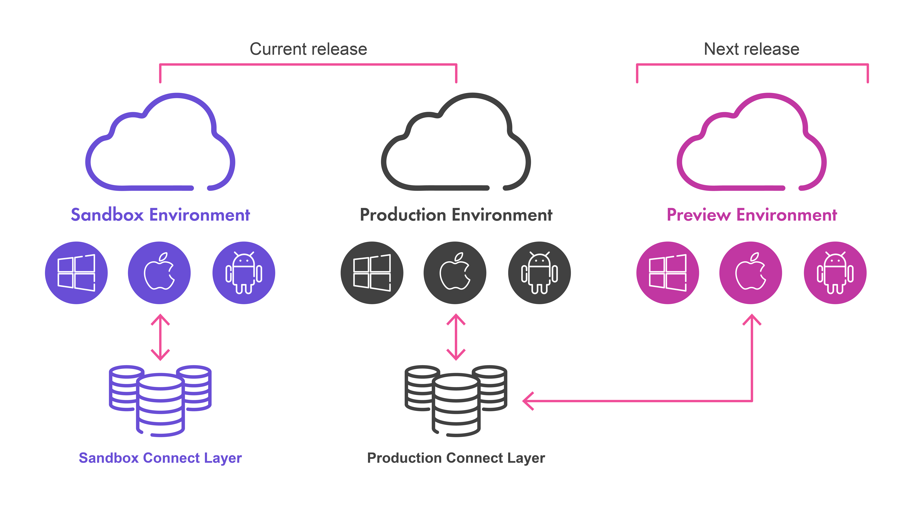

# Welcome

The Purpose of this document is to understand that Finastra provides sandboxes with its core products, so that FinTechs and partners can connect to build, integrate, and test their innovative applications. A sandbox is a test environment with the same Finastra solutions that financial institutions are using across the world. The intended
audience is designers, developers and consumers of Finastra Open APIs available on the [Finastra Developer Portal](https://developer.fusionfabric.cloud/).

# What are the key benefits of sandboxes ?

1. Integrate your application with APIs that respond and process end-to-end test scenarios
2. Test APIs will the same solutions that Financial Institutions are using
3. Get immediate access to the test environment, no need to wait for lengthy and complex authorization to connect to the system of a financial institution

# Sandboxes

# How to use a Sandbox ?

When you register an application on FusionCreator, you get, by default, access to APIs from the Sandbox tenant, that are backed by live instances of core systems. Thus, you experience the interaction with a real environment, very similar to what you can get from a production environment.At this stage, your application is in development mode.
